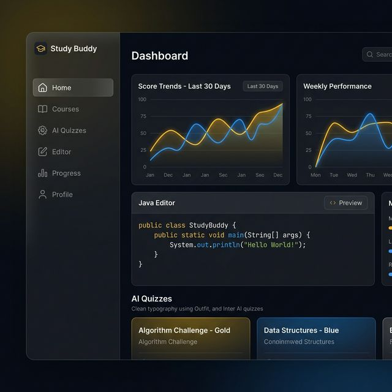
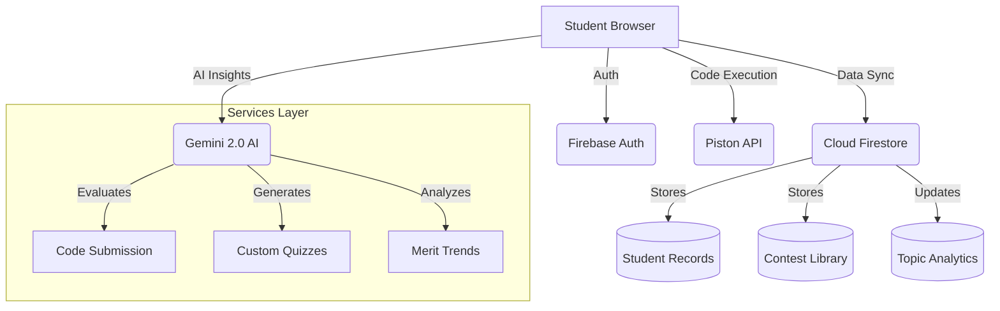

# 🎓 Study Buddy: AI-Powered Learning Ecosystem



**Study Buddy** is a sophisticated, AI-integrated educational platform designed to bridge the gap between assessment and improvement. Built on a modern tech stack, it provides students with a seamless coding environment, real-time performance analytics, and a "Smart Practice" engine that adapts to their unique learning curve.

---

## � Core Pillars

### � Precision Analytics
- **Vedam Merit Scores**: Track normalized performance across **Maths**, **Java**, and **Web**.
- **Dynamic Milestones**: Hard-coded logic for **Innovation Eligibility (60%)** and **Placement Eligibility (75%)**.
- **Historical Trends**: AI-generated reports that synthesize past performance into actionable insights.

### ⚡ Java IDE & Smart Submission
- **Monaco-Powered Editor**: A premium, VS-Code style coding interface.
- **Piston Integration**: Real-time code execution and automated test case validation.
- **AI Feedback Loop**: Instant, hyper-detailed evaluation of submissions, identifying strengths, weaknesses, and optimization paths.

### � Smart Practice Engine
- **Weighted Topic Probability**: Our practice generator doesn't just pick random questions; it uses a weighted algorithm based on **Topic Frequency (ImpTopics)** and **Student Weaknesses**.
- **On-Demand Quizzes**: AI-generated MCQ quizzes for any topic, with difficulty spanning Easy to Hard.

---

## 🏗️ Architecture & Data Flow

Study Buddy utilizes a decoupled architecture where the frontend interacts with specialized micro-services via Firebase and AI layers.



---

## 🔄 The AI Evaluation Pipeline

When a student submits code, a complex multi-stage process is triggered:

1.  **Code Validation**: Piston runs the code against hard test cases.
2.  **AI Heuristics**: The `evaluateCodeSubmission` service analyzes the code structure and efficiency.
3.  **Topic Mapping**: AI maps the submission to specific curriculum topics (e.g., Recursion, Arrays).
4.  **Strength Updating**: `upsertTopicAnalytics` calculates new strength ratings (Weak → Strong).
5.  **Gap Filling**: AI generates 5-10 tailored practice questions to address identified weaknesses.

---

## �️ Admin Mastery

Study Buddy provides a powerful Admin Panel for mentors to manage contests and process bulk results efficiently.

### Bulk Data Processing
Mentors can upload hundreds of results using our optimized JSON intake system.

#### 1. Contest Configuration JSON
```json
{
  "contestTitle": "Java Loops Mastery",
  "difficulty": "medium",
  "questions": [
    {
      "title": "Nested Triangle Pattern",
      "description": "Output a triangle of height N...",
      "expectedSolution": "public class Solution...",
      "testCases": [{"input": "5", "expectedOutput": "*\n**..."}]
    }
  ]
}
```

#### 2. Student Submission Bulk JSON
```json
{
  "contestId": "target_id",
  "submissions": [
    { "studentEmail": "student@vedamsot.org", "questionNumber": 1, "code": "..." }
  ]
}
```

---

## � Tech Stack Deep Dive

| Component | Technology | Role |
| :--- | :--- | :--- |
| **Frontend** | React 18 / Vite | Core framework and HMR |
| **Logic** | Javascript (ESM) | Complex service implementations |
| **Styles** | Custom Vanilla CSS | Premium dark-gold theme |
| **Database** | Firebase Firestore | Real-time NoSQL storage |
| **Auth** | Firebase Auth | Domain-restricted SSO (`@vedamsot.org`) |
| **AI** | Gemini 2.0 / CursorAI | Reasoning engine for quizes/evals |
| **Editor** | Monaco Editor | The core IDE experience |

---

## 🛠️ Performance Setup

1.  **Environment Sync**:
    Ensure `VITE_ALLOWED_EMAIL_DOMAIN` is set to secure your student portal.
2.  **Service Init**:
    Check `src/services/firestore.js` for base collection initialization logic.
3.  **Build Optimization**:
    ```bash
    npm install
    npm run build # For production assets
    npm run dev   # For local development
    ```

---

## 📑 Detailed Documentation
- 📖 **[Database Structure](file:///Users/sidhant/Study_buddy/DATABASE_STRUCTURE.md)**: Every collection and index explained.
- 📖 **[JSON Format Guide](file:///Users/sidhant/Study_buddy/JSON_FORMAT_GUIDE.md)**: Master the admin data intake.

---

## ⚖️ License
© 2026 Vedam School of Technology. All rights reserved.
